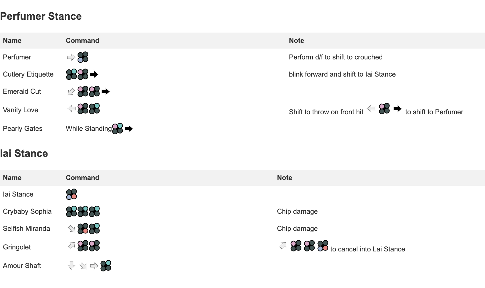

# Very short description of the package

If you're tired of going back and forth in your movelist, generate a simple print out version so you can have it next to your couch.

<!-- I want to show the image poc_generated_content.jpg here in assets folder with markdown -->

[](assets/poc_generated_content.jpg)


**INSPIRATION AND CREDITS TO** https://mspkvp.github.io/tk7movespretty/

## Installation

You can't install the package via composer yet, but you can clone the repository or download the zip file and run the following command:

```bash
composer install
```

## Usage

```php
php index.php
```

### Changelog

Please see [CHANGELOG](CHANGELOG.md) for more information what has changed recently.

## Contributing

Please see [CONTRIBUTING](CONTRIBUTING.md) for details.

## Credits

-   [Nizari](https://github.com/nizari)
-   https://mspkvp.github.io/tk7movespretty/

## License

The MIT License (MIT). Please see [License File](LICENSE.md) for more information.

## PHP Package Boilerplate

This package was generated using the [PHP Package Boilerplate](https://laravelpackageboilerplate.com) by [Beyond Code](http://beyondco.de/).
